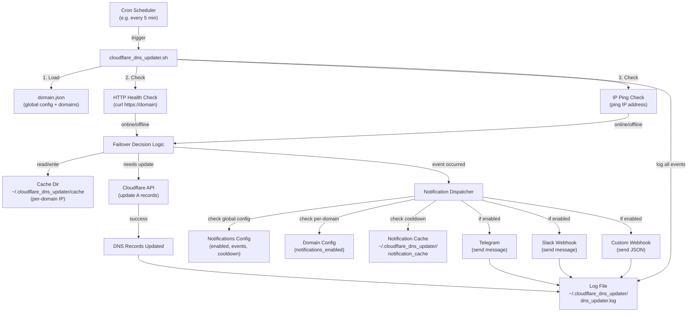
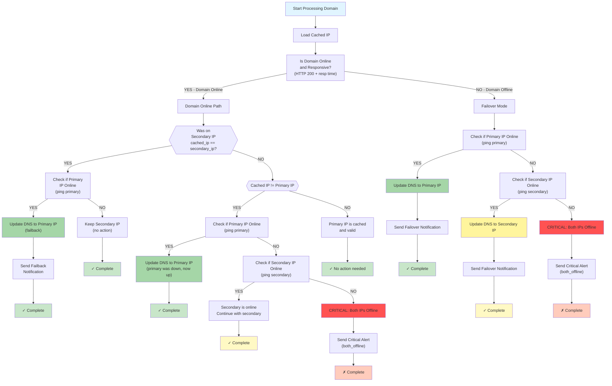
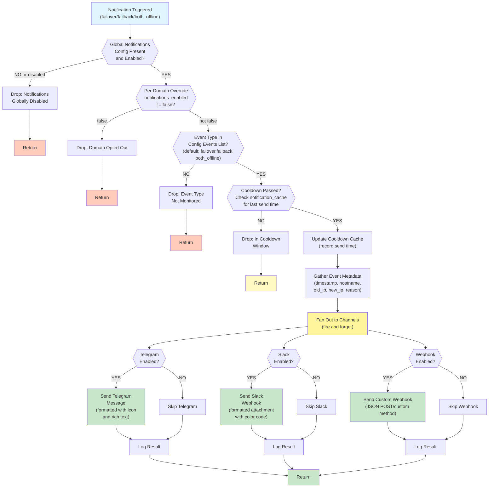
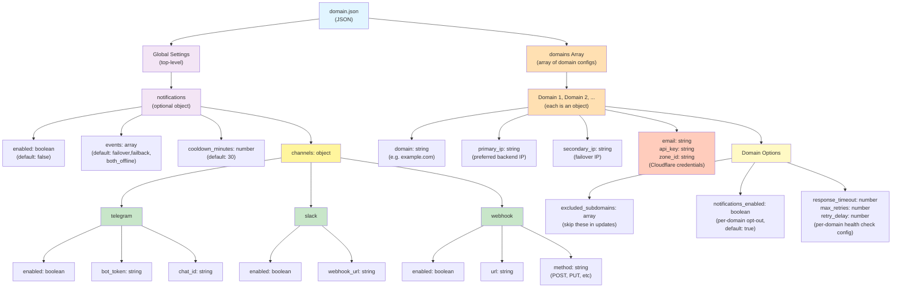

# Cloudflare DNS Auto-Updater Architecture

## Overview

This document describes the architecture of the Cloudflare DNS Auto-Updater script, including system flow, failover logic, notification mechanisms, and configuration structure.

---

## 1. High-Level System Architecture

The system is triggered by a cron job at regular intervals. Each execution performs health checks on configured domains and IPs, then updates DNS records via the Cloudflare API when failover is needed. Notifications are sent through enabled channels while maintaining cooldown windows to prevent spam.



---

## 2. Failover Decision Flowchart

This is the core logic in `main()`. The script iterates through each configured domain and determines whether to update DNS records based on domain health, IP availability, and cached state.



**Key Decision Points:**

- **Domain Online Check**: HTTP GET to domain (must return 200 with response under threshold)
- **Cached IP State**: Determines if we were previously on secondary, can attempt failback
- **IP Ping Check**: Verifies backend IP is reachable (primary/secondary)
- **Both Offline**: Critical alert sent, no DNS update occurs
- **Failback**: Automatic recovery when primary comes back online
- **Failover**: Automatic switch to secondary when domain is offline

---

## 3. Notification Flow

Notifications follow a multi-stage filtering pipeline: global enable check → per-domain opt-out → event type filter → cooldown check → channel fan-out. All channels are "fire and forget" to prevent blocking DNS updates.



**Notification Channels:**

- **Telegram**: Bot token + chat ID, sends formatted message with event icon
- **Slack**: Webhook URL, sends attachment with color-coded event type
- **Webhook**: Custom URL + optional method (POST/PUT), sends JSON payload

**Cooldown Behavior:**

- Per-domain, per-event-type cooldown (default 30 minutes)
- Prevents notification spam during repeated failovers
- Configurable per notification config
- Stored in `~/.cloudflare_dns_updater/notification_cache/`

---

## 4. Configuration Structure

The `domain.json` configuration file supports a new hierarchical structure with global notifications and per-domain settings, while maintaining backward compatibility with legacy array format.



**Example Configuration:**

```json
{
  "notifications": {
    "enabled": true,
    "events": ["failover", "failback", "both_offline"],
    "cooldown_minutes": 30,
    "channels": {
      "telegram": {
        "enabled": true,
        "bot_token": "YOUR_BOT_TOKEN",
        "chat_id": "YOUR_CHAT_ID"
      },
      "slack": {
        "enabled": true,
        "webhook_url": "https://hooks.slack.com/services/..."
      },
      "webhook": {
        "enabled": false,
        "url": "https://your.api/webhook",
        "method": "POST"
      }
    }
  },
  "domains": [
    {
      "domain": "example.com",
      "primary_ip": "192.168.1.100",
      "secondary_ip": "192.168.1.101",
      "email": "user@cloudflare.com",
      "api_key": "YOUR_API_KEY",
      "zone_id": "ZONE_ID",
      "excluded_subdomains": ["internal", "dev"],
      "notifications_enabled": true,
      "response_timeout": 3,
      "max_retries": 3,
      "retry_delay": 2
    }
  ]
}
```

---

## File System Structure

```
~/.cloudflare_dns_updater/
├── cache/
│   ├── example.com          # Last known IP for example.com
│   └── another.com          # Last known IP for another.com
├── notification_cache/
│   ├── example.com_failover # Timestamp of last failover notification
│   └── example.com_failback # Timestamp of last failback notification
└── dns_updater.log          # Timestamped event log (INFO, WARN, ERROR, CRITICAL)
```

---

## Execution Flow Summary

1. **Cron Trigger**: Script runs at configured interval (e.g., every 5 minutes)
2. **Load Config**: Parse `domain.json` for global settings and domain list
3. **Iterate Domains**: For each domain, execute failover decision logic
4. **Health Checks**: HTTP check on domain, ping check on primary/secondary IPs
5. **Cache Lookup**: Compare current cached IP with newly determined IP
6. **Failover Decision**: Update DNS if state changed (see flowchart section 2)
7. **API Call**: If update needed, call Cloudflare API to update all A records
8. **Notification**: If event occurred, dispatch notifications through enabled channels
9. **Logging**: Record all actions to persistent log file
10. **Exit**: Return exit code 0 for success, 1 for errors

---

## Error Handling

- **Network Errors**: Retried with configurable delays and max attempts
- **API Errors**: Logged with error message from Cloudflare
- **Missing Config**: Script exits with error
- **Offline Domains**: Failover attempted automatically
- **Both IPs Down**: Critical alert sent, no DNS change (prevents misconfiguration)
- **Notification Failures**: Logged but do not block DNS updates (fire-and-forget)

---

## Performance Considerations

- **Health Checks**: Default 3-second timeout per request with up to 3 retries
- **Notification Cooldown**: Prevents duplicate alerts (default 30 minutes)
- **Non-Blocking**: Failed notifications do not interrupt DNS updates
- **Concurrent Domains**: Each domain processed sequentially in a single script run
- **Cache**: Persistent cache avoids redundant updates when state hasn't changed

